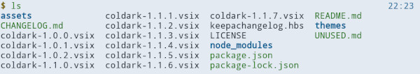
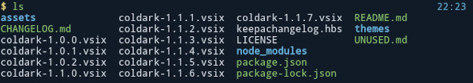
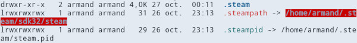
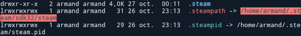
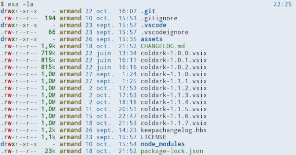
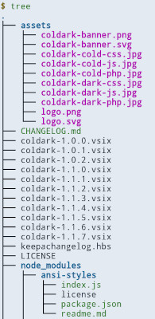
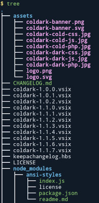

<p align="center">
    
</p>

# Coldark - Dircolors

 

An optimized theme for web development that comes with two versions: light & dark.

## Presentation

[Coldark](https://github.com/ArmandPhilippot/coldark/) is a gray-blue theme. The colors used respect the Web Content Accessibility Guidelines (WCAG) in order to provide sufficient reading comfort.

Coldark dircolors can be installed for all application that respect the `LS_COLORS` environment variable. You can thus use it with commands like `ls`, `tree` ...

It is recommended to use it with [Coldark for XFCE4 terminal](https://github.com/ArmandPhilippot/coldark-xfce4-terminal) so that the colors match those of Coldark.

## Colors

Coldark consists of three color palettes. The first is common to both versions. The other two each apply to a version. Coldark uses 16 colors for each theme.

Coldark dircolors reuses the colors of the terminal: black, white, red, magenta, green, blue, yellow & cyan. If you are using Coldark for XFCE4 terminal, it will only use 8 colors since the normal and bright versions of the colors are the same.

|  | Light Theme |  | Dark Theme |  |
| --- | --- | :-: | :-: | :-: |
| **Usage code** | **Hex** | **Preview** | **Hex** | **Preview** |
| `coldark00` | `#E3E9F2` |  | `#111B27` |  |
| `coldark05` | `#111B27` |  | `#E3E9F2` |  |
| `coldark08` | `#007474` |  | `#5dc2c2` |  |
| `coldark09` | `#7d6600` |  | `#cdb74a` |  |
| `coldark10` | `#005c99` |  | `#6ab3e4` |  |
| `coldark11` | `#237800` |  | `#82c366` |  |
| `coldark12` | `#b800b8` |  | `#ea89ea` |  |
| `coldark15` | `#bf0100` |  | `#f57a73` |  |

- **`coldark00`: Black**  
  Used as foreground for sticky other writable directories.
- **`coldark05`: White**  
  Used as foreground for missing files, files with setuid or setgid permissions, files with capability, sticky not other writable directories and ignored files (like `.log`, `.bak` ...).
- **`coldark08`: Cyan**  
  Used as foreground for symbolic links, regular files with more than one link, pipes and audio files.
- **`coldark09`: Yellow**  
  Used as foreground for socket files, block devices drivers and character device drivers and video files.
- **`coldark10`: Blue**  
  Used as foreground for directories and as background for sticky not other writable directories.
- **`coldark11`: Green**  
  Used as foreground for other writable directories, archives and various documents. Also used as background for sticky other writable directories.
- **`coldark12`: Magenta**  
  Used as foreground for doors and images..
- **`coldark15`: Red**  
  Used as foreground for orphaned symbolic links and executable. Also used as background for missing files.

## Screenshots

Some examples with `ls`, symbolic links (and missing file), `exa` and `tree`.

| Light Theme | Dark Theme |
| :-: | :-: |
|  |  |
|  |  |
|  |  |
|  |  |

## Install

Download the [](https://github.com/ArmandPhilippot/coldark-dircolors/blob/master/dir_colors) file, rename it as `.dir_colors` and place it in your home directory (so `~/.dir_colors`).

## Activation

To activate and use Coldark dircolors as your default color theme for all sessions, you need to edit the configuration file of your shell (`~/.bashrc`, `~/.zshrc`, ... ). Once opened, add the following snippet:

```
# Load Coldark dircolors.
eval "$(dircolors ~/.dir_colors)"
```

## For OhMyZsh users

If you are using OhMyZsh on GNU/Linux, you should place the following code in `~/.zshrc`, right after the `eval`, so that the tab completion uses the same colors:

```
# Zsh Completion with LS Colors
zstyle ':completion:*:default' list-colors "$LS_COLORS"
```

Thanks to [rarylson](https://github.com/ohmyzsh/ohmyzsh/issues/6060#issuecomment-572863893) for the trick.

## License

This project is open source and available under the [MIT License](https://github.com/ArmandPhilippot/coldark-dircolors/blob/master/LICENSE).
